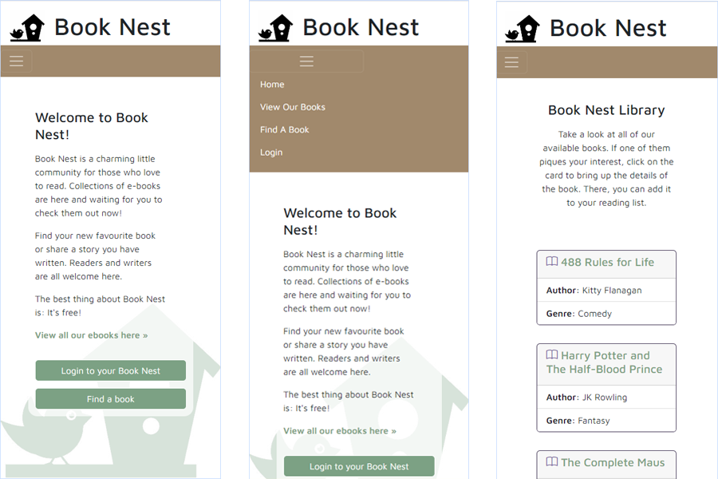
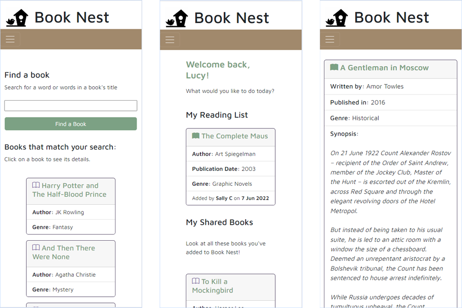
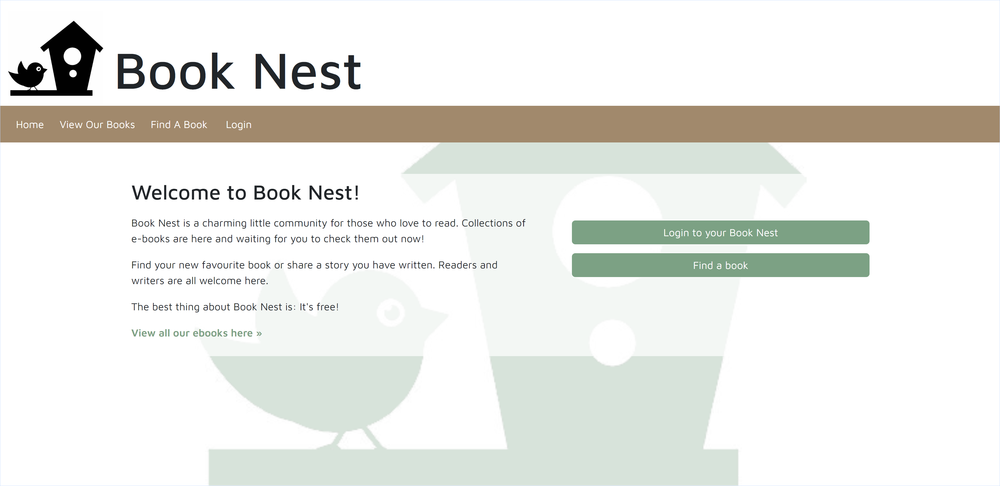
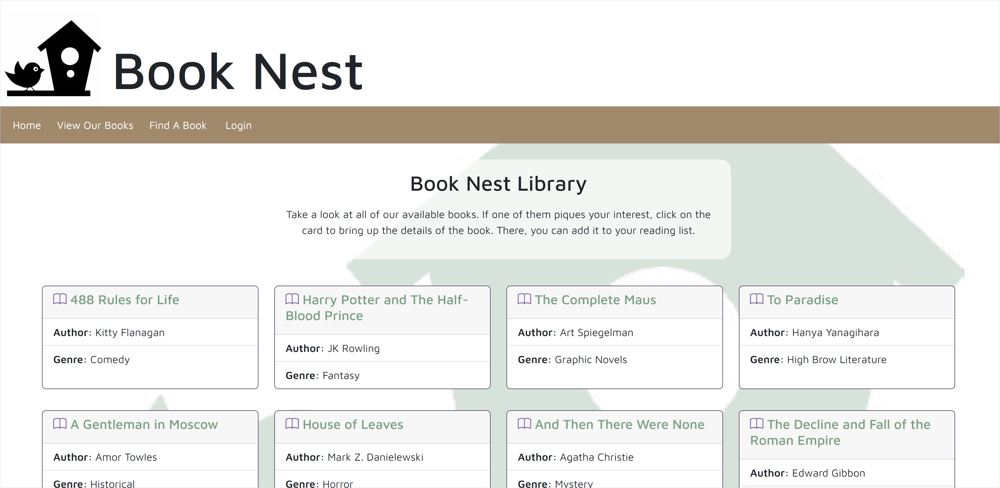
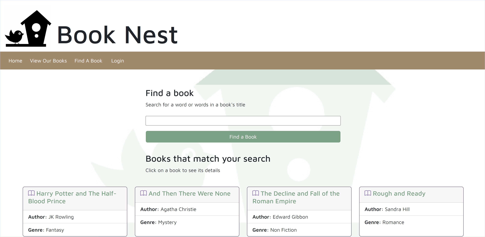
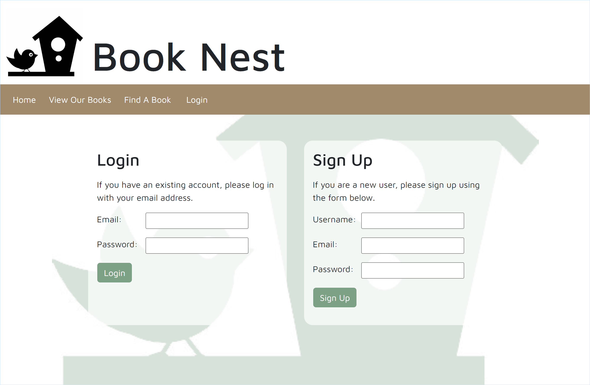

# Book Nest
[](https://opensource.org/licenses/MIT)

## Description

Book Nest is an app for book lovers, a charming community for those who love to read e-books. Readers can find a new favourite book. Book owners can share their e-books. Also, authors can share their stories with the Book Nest community.

The application was designed following the [MVC (Model View Control)](https://www.educba.com/what-is-mvc-design-pattern/) design pattern using a MySQL database with Sequelize ORM, an Express.js back end, and Handlebars templating to present data to the user.

Go to [GitHub](https://github.com/grace-anderson/book-nest) for the Book Nest app's code. See the deployed app on [Heroku](https://the-book-nest.herokuapp.com/).

## Table of Contents

- [Book Nest](#book-nest)
  - [Description](#description)
  - [Table of Contents](#table-of-contents)
  - [Technologies Used](#technologies-used)
  - [Usage](#usage)
  - [Installation](#installation)
  - [Contribution Guidelines](#contribution-guidelines)
  - [Demos](#demos)
  - [Screenshots](#screenshots)
    - [Mobile](#mobile)
      - [Homepage, Navbar and 'View Our Books'](#homepage-navbar-and-view-our-books)
      - ['Find a Book', 'My Profile' and a Book Card](#find-a-book-my-profile-and-a-book-card)
    - [Desktop (>960px)](#desktop-960px)
      - [Homepage](#homepage)
      - [View our Books](#view-our-books)
      - [Find A Book](#find-a-book)
      - [Login or Sign Up](#login-or-sign-up)
  - [Future enhancements](#future-enhancements)
  - [License](#license)
  - [Resources](#resources)

## Technologies Used

This application uses the following technologies:

  Dependencies
* [Node.js](https://nodejs.dev/)
* [Express.js](https://expressjs.com/)
* [handlebars](https://handlebarsjs.com)
* [Express-Handlebars](https://github.com/express-handlebars/express-handlebars)
* [Express-Session](https://www.npmjs.com/package/express-session)
* [MySQL 2](https://www.npmjs.com/package/mysql2)
* [Sequelize](https://www.npmjs.com/package/sequelize)
* [Connect Session Store using Sequelize](https://www.npmjs.com/package/connect-session-sequelize)
* [dotenv](https://www.npmjs.com/package/dotenv)
* [bcrypt](https://github.com/kelektiv/node.bcrypt.js)

Dev dependencies
* [Nodemon](https://www.npmjs.com/package/nodemon)
* [Husky](https://typicode.github.io/husky/#/)
* [ESLint](https://eslint.org/)
* [Prettier](https://prettier.io/docs/en/index.html)

Deployment
* [Heroku](https://www.heroku.com/)
* [JawsDB](https://www.jawsdb.com/)

## Usage

* Access the deployed Book Nest app via [Heroku](https://the-book-nest.herokuapp.com/)
* See [Demos](#demos) below that depict the Book Nest's functionality
* Book Nest is a responsive app. See [Screenshots](#screenshots) to view mobile and desktop screen sizes.

## Installation

To install and run Book Nest locally,
* Download or clone the code from the [Book Nest GitHub Repository](https://github.com/grace-anderson/book-nest
* Open in your preferred terminal (e.g. [Visual Studio Code's](https://code.visualstudio.com/) integrated terminal)
* Navigate to the specified folders in order and run the listed command(s):
  * In the 'db' folder:
  ```
  mysql -u root -p;
  [at the prompt, enter your password to access your MySQL Shell]

  source schema.sql;
  ```
  * In the root directory:
  ```
  npm install

  npm run seed
  ```
* To start the app: 
  * After installation, in the root directory, run the following command:
  ```
  npm run watch
  ```

## Contribution Guidelines

* Contributions are welcome.
* The code is located in this [GitHub](https://github.com/grace-anderson/book-nest) repo
* To contribute, open a new issue describing your proposed enhancement or fix.
  * Before contributing, browse through the [Future enhancements](#future-enhancements) and open issues to see if your issue already exists or if there is an issue/enhancement you might be able to solve. 
  * If you're a newbie dev, start contributing by looking for issues labelled "good first issue"
* It is good practice to set up your project repository as an "upstream" remote and synchronize with the project repository
  * Don't update the main branch. Rather create your own branch using a brief descriptive name and make your changes there
* You can create pull requests, but only admins can review and merge.
  * Be nice to your reviewer by adding adding a plain English explanation of your pull request and how your updates addresses the issue/s or enhancements  
* Also see the [GitHub Community Guidelines](https://docs.github.com/en/site-policy/github-terms/github-community-guidelines)

## Demos

These gifs demonstrate Book Nest's current functionality

1. View Our Books (user is not logged in)
    >  
2. Find A Book (user is not logged in)
    >  
3. Sign up and My Profile
    >  
4. Find A Book and add to My Reading List
    > 
5. Remove a book from My Reading List
    > 
6. Share a Book
    > 
7. Login, navigate, Logout
    >  

## Screenshots
### Mobile 
#### Homepage, Navbar and 'View Our Books'
 

#### 'Find a Book', 'My Profile' and a Book Card
 

### Desktop (>960px)
Screenshots of desktop (>960px) size for homepage, 'View Our Books', 'Find A Book', and 'Login'

#### Homepage
 

#### View our Books
 

#### Find A Book
 

#### Login or Sign Up
 

## Future enhancements

* User interface: margins on nav buttons to stop pushing out, more colour contrast
* Manage when user tries to add a book already in their reading list (e.g. no "add to reading list button)
* Manage when user tries to remove a book already in their reading list (e.g. no "remove from reading list" button)
* Retain text in search so user sees their typed search
* Link book record on reading list to its ebook
* User checkout to read or reserve an ebook
* Delete a book record
* Edit a book record
* Add images to a book record
* Enhanced context-sensitive navigation
* Notifications (e.g. when a new book in a favourite genre is shared)
* Login with social media account

## License

© 2022 [Sushan Yue](https://github.com/AtlantaBlack), [Helen Anderson](https://github.com/grace-anderson), [Marko-Petreski](https://github.com/Marko-Petreski), [Muhamad Sahid](https://github.com/s3793758)

This project is licensed under the [MIT License](https://opensource.org/licenses/MIT).

## Resources

* [GitHub](https://github.com/)
* [Google Drive](https://drive.google.com/)
* [Google Slides](https://www.google.com/slides/about/)
* [Miro](https://miro.com/miroverse/)
* [PhotoShop](https://www.adobe.com/au/products/photoshopfamily.html)
* [Visual Studio Code](https://code.visualstudio.com/)
